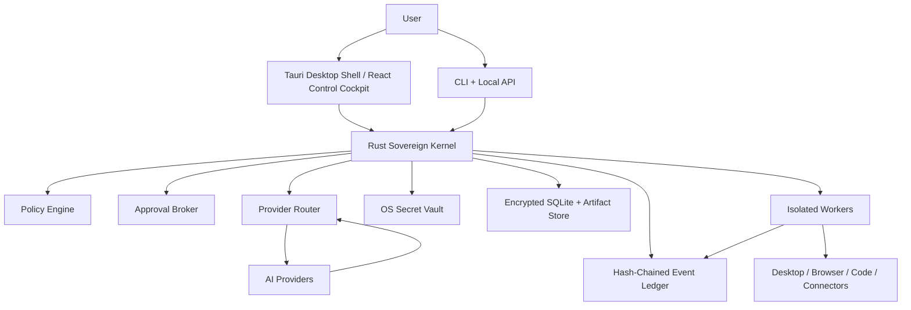

# Sovereign Agent Design

Date: 2026-06-21
Status: Approved design, awaiting written-spec review
Project: Agent Memory Knowledgebase

## Purpose

Build the current knowledge dashboard into a local-first autonomous software agent that can complete real tasks across code, browser, desktop, files, connectors, and long-running workflows while staying inspectable, recoverable, and under human control.

The goal is not to claim superiority by marketing language. The goal is to surpass comparable systems on measured outcomes:

- Higher verified task-completion rate on real workflows.
- Lower user-intervention rate at the same risk level.
- Stronger recovery from tool failures, model errors, and ambiguous state.
- Clearer evidence for what happened and why a task is complete.
- Better provider portability across OpenAI, Google Gemini, AWS Bedrock, OpenRouter, DeepSeek, GLM, and future providers.
- Lower cost at a defined quality threshold.

This spec defines the target architecture and boundaries. It does not authorize implementation yet. The next step after review is a separate implementation plan.

## Non-Negotiable Invariants

- Models propose; a trusted kernel decides.
- The model never receives unrestricted credentials or unrestricted operating-system authority.
- Irreversible, privileged, financial, credentialed, or externally visible actions cross an approval gate.
- Every task completes only when verifier evidence satisfies the original goal contract.
- Every action, approval, observation, state transition, artifact, and recovery attempt is recorded in an append-only ledger.
- Skills and prompts may evolve inside approved policy envelopes; kernel/core changes require evaluated release proposals, signed snapshots, rollback, and user activation.
- Web pages, documents, screen contents, and tool outputs are untrusted input. They can inform decisions but cannot grant permissions.
- Dashboard claims must come from kernel events and stored evidence, not generated narrative.

## System Overview

The architecture is a local-first "Sovereign Agent Kernel" with a desktop dashboard and isolated execution workers.



### Components

**Desktop Shell**

The Tauri desktop app hosts the React control cockpit, notifications, approval cards, workspace navigation, and OS integrations. It is a projection of kernel state, not the authority for truth.

**CLI and Local API**

The CLI and local API support headless tasks, scripts, editor integrations, and automation. They speak the same authenticated IPC protocol as the dashboard.

**Rust Sovereign Kernel**

The kernel owns task scheduling, policy checks, approvals, budgets, provider routing, event recording, state transitions, crash recovery, and capability issuance. It should remain small, auditable, and versioned separately from skills and UI code.

**Isolated Workers**

Workers execute scoped jobs in TypeScript, Python, browser automation, desktop automation, connector processes, and skill runtimes. Workers receive short-lived capability tokens and cannot mint new authority.

**Provider Adapters**

Provider adapters run as narrow processes with normalized streaming, tool-call, context, retry, and error contracts. Supported providers include OpenAI, Gemini, Bedrock, OpenRouter, DeepSeek, and GLM.

**Storage**

Storage uses encrypted SQLite for goals, tasks, policies, memories, skills, and model/provider metadata. A hash-chained ledger records actions, approvals, observations, and transitions. An artifact store holds diffs, logs, screenshots, files, eval reports, and replay bundles. Secrets live in the OS vault, not browser storage.

## Task Lifecycle

Every task starts with a goal contract and ends only with evidence.

1. **Goal contract**
   The system captures objective, constraints, success criteria, allowed autonomy level, budget, deadlines, required artifacts, and verification requirements.

2. **Context assembly**
   The agent gathers relevant project files, memories, policies, skills, provider capabilities, and external context. Each input is tagged with source, timestamp, confidence, and sensitivity.

3. **Task graph**
   The planner creates a typed graph of work units. Each node declares required capabilities, dependencies, risk level, expected artifacts, and verifier.

4. **Risk gate**
   The kernel checks policy, scope, budget, credentials, and side effects before execution. The gate may allow, deny, request approval, reduce scope, or require a safer plan.

5. **Bounded execution**
   Workers execute through capability tokens with operation limits, time limits, network limits, filesystem scopes, and replay metadata.

6. **Observation**
   Results become structured observations with artifacts, logs, screenshots, diffs, test output, and provider traces.

7. **Independent verification**
   A verifier checks whether the node satisfies its contract. Verification can use tests, replay, static checks, screenshot comparison, API confirmation, human approval, or a separate model review.

8. **Outcome**
   A node ends as pass, recoverable failure, blocked, denied, or cancelled. Recoverable failures trigger diagnosis and retry under budget. Blocked states must explain the missing information or permission.

Completion requires every required node in the graph to have passing evidence or an explicitly accepted exception.

## Memory Fabric

The memory system is evidence-bearing, scoped, and inspectable.

### Memory Types

- **Working memory:** short-lived task state.
- **Episodic memory:** what happened in prior runs, with artifacts and outcomes.
- **Semantic memory:** stable facts about projects, users, tools, APIs, and environments.
- **Procedural memory:** skills, recipes, tests, prompts, and tool-use patterns.
- **Intent memory:** durable user preferences and standing constraints.

### Memory Record Fields

Every durable memory record includes provenance, confidence, scope, sensitivity, retention policy, contradiction links, created and updated timestamps, evidence references, and revocation status.

### Learning Loop

Learning follows an evidence-gated loop:

1. Verified outcome.
2. Credit assignment.
3. Candidate learning.
4. Consolidation gate.
5. Inspectable promotion.

Memories can be contradicted, superseded, or revoked. The system should prefer scoped, source-backed memories over vague global summaries.

## Skill Foundry

The Skill Foundry creates and improves capabilities when the agent detects a repeatable capability gap.

### Skill Creation Flow

1. Detect a gap from failed or inefficient work.
2. Search existing skills, tools, docs, and provider capabilities.
3. Specify a skill contract with inputs, outputs, permissions, tests, and success criteria.
4. Generate a candidate skill in a sandbox.
5. Evaluate it against deterministic tests and replayed tasks.
6. Canary activate under tight policy.
7. Promote, revise, or rollback based on evidence.

### Skill Package Contract

A skill package includes manifest, permission scopes, dependency lock, tests, evals, provenance, supported platforms, rate limits, side-effect declarations, expected artifacts, and rollback instructions.

Skills are untrusted packages until promoted. Routine skills and routing rules may auto-promote only inside an approved policy envelope. Core release proposals always require explicit user activation.

## Provider Router and Multi-Agent Scheduler

The provider router chooses models by evidence, not brand loyalty.

### Provider Modes

- **Automatic mode:** default. The router chooses the provider and model based on task fit.
- **Pinned mode:** user or policy fixes a provider/model for a task or workspace.
- **Ensemble mode:** used for high-risk, high-uncertainty, or expensive-to-fail tasks.

### Routing Signals

The router scores task fit, tool support, context length, privacy constraints, data residency, latency, cost, reliability, model-specific eval scores, structured-output quality, and recent failure patterns.

### Multi-Agent Scheduler

The scheduler can issue scoped worker leases to specialist agents such as planner, researcher, coder, desktop operator, verifier, security reviewer, critic, and skill builder.

Workers receive isolated context bundles, workspace snapshots, deadlines, budgets, and capability tokens. They exchange typed artifacts and evidence, not unrestricted shared chat history.

There is no unbounded recursive swarm. Fan-out, depth, spend, runtime, and authority are always bounded by kernel policy. A worker cannot create new workers with broader authority than it received.

### Provider Safety Rules

- Credentials stay in the OS vault.
- Fallback never blindly replays side-effecting calls.
- Provider scores are updated from local evals and verified outcomes.
- Ensemble disagreement produces uncertainty evidence, not automatic truth.
- A provider cannot change task policy or grant itself tool access.

## Capability Runtime and Desktop Control

Capabilities are the only way to touch the outside world.

### Capability Families

- **Code:** filesystem, shell, builds, tests, package managers, Git, editors.
- **Browser:** navigation, DOM inspection, forms, downloads, screenshots, sessions.
- **Desktop:** accessibility tree, keyboard, mouse, window management, screenshots.
- **Connectors:** email, calendars, files, issue trackers, cloud APIs, databases.
- **Comms:** notifications, drafts, messages, status reports.
- **Automation:** scheduled tasks, monitors, background workflows.

### Capability Broker

The kernel validates each requested capability by schema, risk level, scope, identity, budget, preconditions, approval grant, and replay safety.

A short-lived token may define:

```text
tool = filesystem.write
root = workspace
paths = ["src/**", "docs/**"]
expires = 10 minutes
max_ops = 40
network = denied
verifier = tests-and-diff
```

### Risk Ladder

- **L0 Observe:** read-only inspection. Auto-allowed inside scope.
- **L1 Reversible local:** local edits or commands with snapshots and rollback. Auto-allowed inside scope.
- **L2 Scoped external:** allowlisted external actions under pre-approved policy.
- **L3 Consequential:** destructive, credentialed, financial, public, or privileged actions. Ask first.
- **L4 Forbidden:** actions outside policy. Deny.

### Desktop Action Loop

Desktop control follows a perceive, ground, authorize, act, re-observe, verify loop. The system prefers accessibility trees and structured APIs; vision fallback is used when structure is unavailable. Desktop automation must verify authoritative state after acting.

## Human Control Cockpit

The dashboard is a command center for truth, not a decorative chat wrapper.

### Core Areas

- **Top bar:** private mode, budget, worker count, provider status, and Stop All.
- **Left rail:** workspaces, goals, policies, skills, memories, providers, approvals, automations.
- **Center:** active mission, goal contract, task graph, live execution feed, approval cards, recovery decisions.
- **Right rail:** evidence, active context, memory candidates, skill changes, model routing, health metrics, artifacts.

### Dashboard Rules

- Every status badge comes from a kernel event.
- Every completion claim links to evidence.
- Every approval card states requested authority, risk, scope, alternatives, and rollback.
- The user can pause, stop, lower autonomy, revoke tokens, inspect memory, and replay task history.
- The agent may organize goals, surface relevant memories, open panels, and create approval cards through typed control-plane commands.
- The agent cannot conceal, rewrite, or delete the audit trail.

## Delivery Roadmap

The project should ship in phases with hard verification gates.

### Phase 0: Honest, Testable Prototype

Fix the current prototype so it stops over-claiming and becomes testable.

Scope:

- Fix the chat state bug that can drop messages during assistant response handling.
- Remove unsupported AES-256/localStorage security claims.
- Replace random or simulated intelligence metrics with honest prototype state.
- Add persistence schemas for sessions, memories, and artifacts.
- Add baseline unit and integration tests.

Gate:

- Deterministic chat and memory tests pass.
- Security claims match actual storage behavior.
- Build, lint, and baseline tests pass.

### Phase 1: Kernel MVP

Introduce the trusted local kernel.

Scope:

- Goal contracts.
- Task graph.
- Event ledger.
- Approval broker.
- Budget enforcement.
- Sandboxed file and shell execution.
- One provider adapter.
- Verified completion for local coding tasks.

Gate:

- The agent can complete real coding tasks safely with logged approvals, diffs, tests, and replayable evidence.

### Phase 2: Memory Fabric and Skill Foundry

Make learning inspectable and useful.

Scope:

- Evidence-backed memory records.
- Memory promotion and revocation.
- Skill manifests.
- Sandbox skill generation.
- Deterministic skill tests and replay evals.
- Canary activation and rollback.

Gate:

- A learned skill beats the baseline on a repeated workflow without expanding permissions.

### Phase 3: Provider Intelligence

Add provider portability and measured routing.

Scope:

- Adapters for OpenAI, Google Gemini, AWS Bedrock, OpenRouter, DeepSeek, and GLM.
- Normalized streaming and structured-output contracts.
- Provider conformance suite.
- Cost, latency, reliability, and quality telemetry.
- Automatic, pinned, and ensemble routing modes.

Gate:

- Routing improves cost or reliability at the same quality threshold on benchmark tasks.

### Phase 4: Browser, Desktop, Connectors, and Automations

Expand action space under capability tokens.

Scope:

- Browser automation.
- Desktop control using accessibility-first perception.
- Connector framework.
- Scheduled tasks and monitors.
- Prompt-injection defenses.
- Authoritative-state verification.

Gate:

- End-to-end desktop and connector workflows pass with clear evidence, bounded permissions, and recovery from common failures.

### Phase 5: Measured Autonomy

Support long-running goals and safer self-improvement.

Scope:

- Long-running missions.
- Recovery manager.
- Parallel specialist workers.
- Benchmark corpus.
- Signed core-release proposals.
- Rollback and release hardening.

Gate:

- The system shows sustained unattended success on real workflows while preserving auditability, policy compliance, and user override.

## Required Verification

- Unit tests for kernel policy, routing, memory, skills, and capability tokens.
- Contract tests for provider adapters and tool packages.
- Recorded task replay for regressions.
- Permission and prompt-injection tests.
- Crash and checkpoint recovery tests.
- Desktop and browser end-to-end tests.
- Real-world benchmark corpus with task definitions, expected evidence, cost, intervention count, and completion criteria.
- Security review for vault access, IPC authentication, ledger integrity, and sandbox escape paths.

## Explicitly Rejected

- Generated terminal logs as proof of success.
- Randomized or decorative accuracy scores.
- Secrets stored in browser localStorage.
- Unbounded agent recursion.
- Silent core mutation.
- Blind provider fallback for side-effecting actions.
- Claims of surpassing other products without benchmark evidence.
- Dashboard progress that is not backed by kernel events.

## Current Prototype Implications

The existing React/Vite/Express app is useful as a visual and conceptual prototype, especially for memory dashboards, agent activity views, and user-facing control surfaces. It should not be treated as the trusted runtime.

The earliest work should separate presentation from authority:

- Keep the dashboard useful, but make it a client of kernel state.
- Move durable state and security-sensitive operations out of localStorage.
- Replace simulated self-improvement with evidence-backed memory and skill promotion.
- Treat provider integrations as adapters behind the kernel, not UI-level API calls.

## Open Decisions for the Implementation Plan

These are intentionally left for the implementation plan, not this design spec:

- Whether the first kernel MVP is a separate Rust workspace or introduced alongside the existing app and later split.
- Which provider becomes the first adapter for Phase 1.
- Which sandbox backend is used first on Windows.
- Which benchmark tasks define the first measurable success threshold.
- How much of the current UI is preserved during Phase 0.

## Review Gate

This spec is ready for user review. After approval, the next step is to write a detailed implementation plan using the approved phase order and verification gates above.
